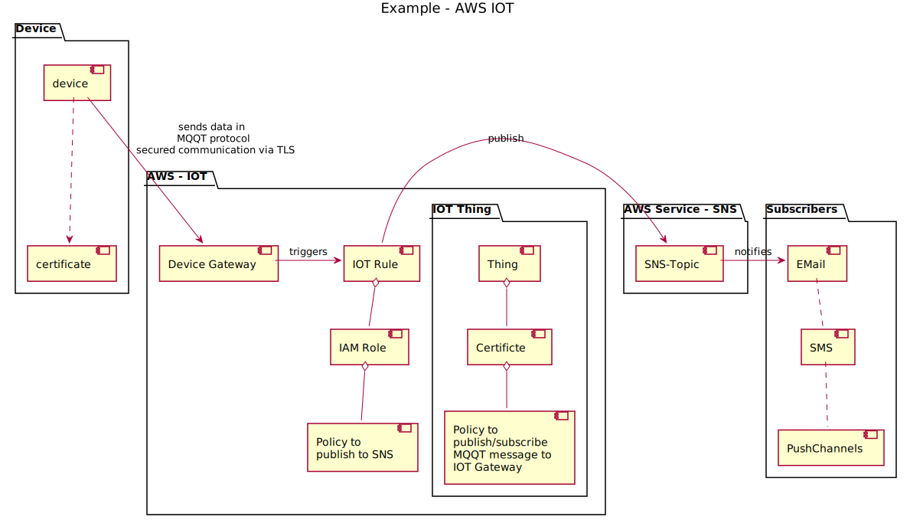

# aws-iot
## What is IOT?
The Internet of things is a system of interrelated computing devices, mechanical and digital machines with the ability to transfer data over a network without requiring human-to-human or human-to-computer interaction.
It is about extending the power of the internet beyond computers and smartphones to a whole range of other things, processes, and environments.

## What is AWS IOT?
AWS IoT enables secure, bi-directional communication between Internet-connected things and the AWS cloud. This enables collection of telemetry data from multiple devices and store and analyze the data.

## Example
### 
